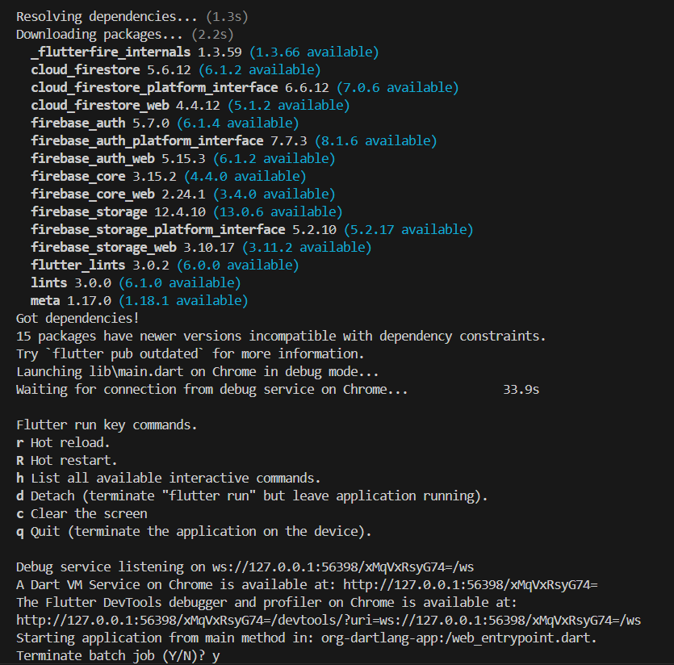

# Flutter Folder Structure Exploration (SmartKirana)

## Brief Description

This sprint explores and documents the default Flutter project structure and explains the role of each core folder and configuration file used for app development, platform builds, and maintainability.

## Summary

- Detailed folder explanation is documented in [PROJECT_STRUCTURE.md](PROJECT_STRUCTURE.md).
- Core directories reviewed: `lib/`, `android/`, `ios/`, `assets/`, `test/`, and `build/`.
- Supporting files reviewed: `.gitignore`, `.dart_tool/`, `.idea/`, and `pubspec.yaml`.

## Screenshots of Folder Hierarchy

> Replace these with your latest IDE hierarchy screenshots if needed.




## Reflection

### Why is it important to understand each folder’s purpose?

Understanding folder responsibilities helps developers locate code quickly, avoid accidental edits in generated/platform areas, and maintain cleaner architecture as features grow.

### How does a well-organized structure improve teamwork and development speed?

A consistent structure enables parallel development, faster onboarding, easier reviews, and quicker debugging because everyone knows where to add or find specific logic.

## Submission Guidelines

### Commit Message

```bash
docs: added Flutter project structure explanation and folder overview
```

### Pull Request Title

```text
[Sprint-2] Flutter Folder Structure Exploration – TeamName
```

### PR Description Template

```markdown
## Summary of Exploration

- Reviewed Flutter core folders and supporting files.
- Documented folder responsibilities and structure decisions.

## Screenshot

- Added IDE folder hierarchy screenshot(s).

## Documentation Link

- See PROJECT_STRUCTURE.md for full folder-by-folder explanation.
```
