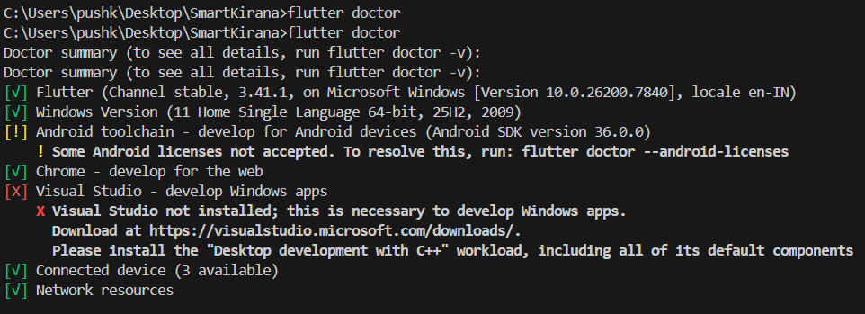
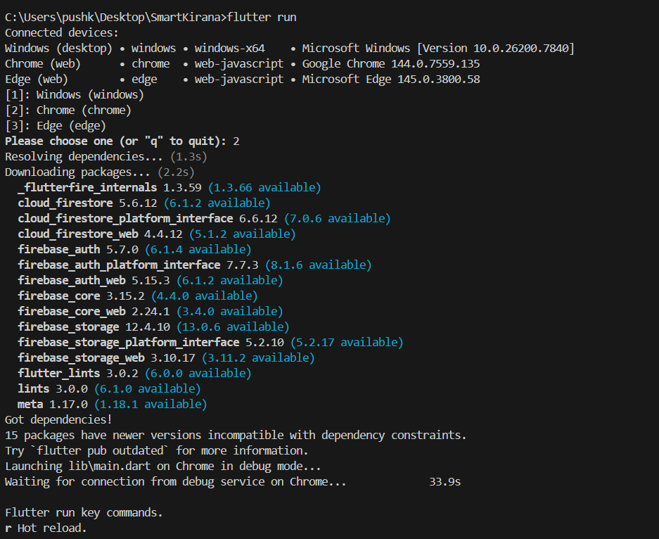

# Flutter Environment Setup and Verification

## Brief Description

This document verifies a complete Flutter development environment setup on Windows, including Flutter SDK installation, Android Studio + plugins configuration, emulator setup, and successful first app run.

## Steps Followed

### 1) Install Flutter SDK

- Downloaded Flutter SDK from the official Flutter website.
- Extracted SDK to a local development directory.
- Added `flutter\bin` to system `PATH` through Environment Variables.
- Opened a new terminal and verified setup using:

```bash
flutter doctor
```

### 2) Set Up Android Studio / VS Code

- Installed Android Studio.
- Confirmed Android SDK, Android SDK Platform tools, and AVD Manager were installed.
- Installed Flutter and Dart plugins.
- VS Code can also be used with Flutter and Dart extensions from Marketplace.

### 3) Configure and Launch Emulator

- Created Android Virtual Device from AVD Manager.
- Used a modern device profile and Android 13+ image.
- Started emulator and verified visibility to Flutter:

```bash
flutter devices
```

### 4) Create and Run First Flutter App

- Created app using:

```bash
flutter create first_flutter_app
cd first_flutter_app
flutter run
```

- Verified default Flutter counter app launches on emulator.

## Setup Verification

### Flutter Doctor Output



### Emulator Running Flutter App



## Reflection

### Challenges Faced

- Initial environment path/toolchain validation took a few iterations.
- Ensuring all Android toolchain components were installed correctly.
- Emulator performance tuning and first launch wait time.

### How This Setup Helps Flutter Development

- Provides a stable local workflow for build, run, and debug.
- Enables fast iteration with emulator/device testing.
- Establishes the baseline required for future Firebase and feature integration work in this project.

## Submission Guidelines

### Commit Message

```bash
setup: completed Flutter SDK installation and first emulator run
```

### Pull Request Title

```text
[Sprint-2] Flutter Environment Setup – TeamName
```

### PR Description Checklist

- Steps followed for setup and verification.
- Screenshots included from README.
- Short reflection on installation/setup experience.
